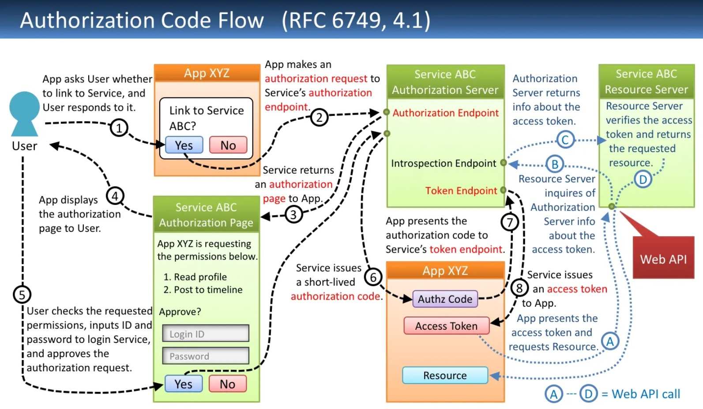

# OAuth flow types
## 1. Authorization code flow
Authorization Code Flow exchanges an authorization code for a token. For this exchange to take place, you have to also pass along your app’s Client Secret. The secret must be securely stored on the client side. The implicit flow is suitable for applications that access APIs and cannot store sensitive information.

Use Cases: Server side web applications where the source code is not exposed publicly.

How this OAuth flow works:
1. The user clicks on a login link in the web application.
2. The user is redirected to an OAuth authorization server, after which an OAuth login prompt is issued.
3. The user provides credentials according to the enabled login options.
4. Typically, the user is shown a list of permissions that will be granted to the web application by logging in and granting consent.
5. The user is redirected to the application, with the authorization server providing a one-time authorization code.
6. The app receives the user’s authorization code and forwards it along with the Client ID and Client Secret, to the OAuth authorization server.
7. The authorization server generates an ID Token, Access Token, and an optional Refresh Token, before providing them them to the app.
8. The web application can then use the Access Token to gain access to the target API with the user’s credentials.

## 2. Client Credentials Flow

The Client Credentials Flow allows applications to pass their Client Secret and Client ID to an authorization server, which authenticates the user, and returns a token. This happens without any user intervention.

Relevant for: M2M apps (daemons, back-end services, and CLIs). In these types of apps, the system authenticates and grants permission behind the scenes without involving the user, because the “user” is often a machine or service role. It doesn’t make sense to show a login prompt or use social logins.

How this OAuth flow works:
1. The application authenticates with the OAuth authorization server, passing the Client Secret and Client ID.
2. The authorization server checks the Client Secret and Client ID and returns an Access Token to the application.
3. The Access Token allows the application to access the target API with the required user account.

## 3. Resource Owner Password Flow

The Resource Owner Password Flow asks users to submit their credentials via a form. Credentials are transferred to the backend and may be retained for future use, before an Access Token is granted. It’s essential that the app is completely trusted. Therefore, this flow is generally not recommended.

Use Cases: Highly-trusted applications, where other flows based on redirects cannot be used.

How this OAuth flow works:
1. The user clicks a login link in the application and enters credentials into a form managed by the app.
2. The application stores the credentials, and passes them to the OAuth authorization server.
3. The authorization server validates credentials and returns the Access Token (and an optional Refresh Token).
4. The app can now access the target API with the user’s credentials.

## 4. Implicit Flow with Form Post

This flow uses OIDC to implement a web sign-in that functions like WS-Federation and SAML. The web app requests and receives tokens via the front channel, without requiring extra backend calls or secrets. With this process, you don’t have to use, maintain, obtain or safeguard secrets in your app. 

Use Cases: Apps that don’t want to maintain secrets locally.

## 5. Hybrid Flow

This flow can benefit apps that can securely retain Client Secrets. It lets your app obtain immediate access to an ID token, while enabling ongoing retrieval of additional access and refresh tokens. This is useful for apps that need to immediately gain access to data about the user, but must perform some processing prior to gaining access to protected resources for a long time.

Use Cases: Apps that need immediate access to data about the user, but also need to use this data on an ongoing basis.

## 6. Device Authorization Flow

This flow makes it possible to authenticate users without asking for their credentials. This provides a better user experience for mobile devices, where it may be more difficult to type credentials. Applications on these devices can transfer their Client ID to the Device Authorization Flow to start the authorization process and obtain a token.

Use Cases: Apps running on input-constrained devices that are online, enabling seamless authentication via credentials stored on the device.

## 7. Authorization Code Flow with PKCE

This flow uses a proof key for code exchange (PKCE). A secret known as a Code Verifier is provided by the calling application, which may be verified by the authorization server using a Proof Key. 

Use Cases: Apps that need to serve unknown public clients who may introduce additional security issues that are not addressed by the Auth Code Flow. 

# References 

https://frontegg.com/blog/oauth-flows

https://datatracker.ietf.org/doc/html/rfc6749
